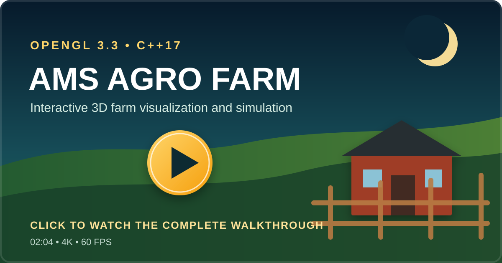

<div align="center">

# AMS Agro Farm

### Interactive 3D Agro-Farm Visualization in Modern OpenGL

An explorable farm simulation featuring animated livestock, task-driven farm
activity, collision-aware navigation, textured procedural geometry, independent
lighting systems, day/night behavior, and multiple technical camera views.


</div>

## Project Demo

<div align="center">
  <a href="https://drive.google.com/file/d/1EMApkfHGZpR_ZDTFk81WqK6BsHAgqDNJ/view?usp=sharing">
    
  </a>
  <br>
  <strong><a href="https://drive.google.com/file/d/1EMApkfHGZpR_ZDTFk81WqK6BsHAgqDNJ/view?usp=sharing">▶ Watch the complete project </a></strong>
  <br>
  <sub>Full project video hosted on Google Drive</sub>
</div>

## Overview

AMS Agro Farm is a real-time graphics project developed for **CSE 4102 —
Computer Graphics and Image Processing Laboratory**.

The farm contains a Holstein milking cow, a Brahman-type ox, two calves,
chickens, ducks, a nesting hen with chicks, and a command-driven worker. Animal
and worker routines respond to user commands and the active time of day.

## Key Features

| Area | Implementation |
|---|---|
| Environment | Textured terrain, entrance, curved owner billboard, fences, sheds, worker house, trees, hay, crates, water facility and farm props |
| Livestock | One milking cow, one ox, two calves, poultry, nesting hen and chicks |
| Animation | Hierarchical body joints, walking, grazing, tails, worker tasks, rotating fans, gates and shelter routines |
| Farm logic | Calf release/return/feeding routes, worker feeding workflow, daytime roaming and automatic night sheltering |
| Lighting | Phong shading, directional sunlight, grouped point lights, entrance spotlight and independent fixture controls |
| Navigation | Free-look camera with swept collision against gates, walls, fences, trees, stalls and equipment |
| Camera modes | Perspective exploration, bird's-eye view and four simultaneous perspective/orthographic views |
| Curved geometry | Bézier surface-of-revolution milk can, B-spline irrigation pipe and sampled ruled shed roof |

## Graphics Techniques

- Modern OpenGL 3.3 Core Profile with reusable VAO, VBO and EBO meshes
- Model, view and projection transformations using GLM
- Per-fragment Phong ambient, diffuse and specular lighting
- Multiple independently controlled light sources with emissive fixtures
- Indexed procedural meshes with positions, normals and UV coordinates
- Texture mapping with mipmaps and multiple wrapping modes
- Hierarchical modeling with local joint pivots
- Delta-time animation independent of frame rate
- Cubic Bézier and uniform cubic B-spline surface generation
- Perspective and orthographic multi-viewport rendering
- Swept camera collision to prevent tunneling through thin obstacles

## Build and Run

### Requirements

- Windows 10 or Windows 11
- MinGW GCC installed at `C:\MinGW`
- Visual Studio Code with the Microsoft C/C++ extension, or Visual Studio 2022
- The supplied `CSE 4208 - Graphics` folder beside `ams_agro_farm`


The project already includes the MinGW GLFW import library and runtime DLL.
GLAD, GLFW headers, GLM and `stb_image` are referenced from the course folder.

### VS Code

1. Open the `ams_agro_farm` folder in VS Code.
2. Open `main.cpp`.
3. Click the **Run** triangle in the upper-right corner.

The shared VS Code task calls `run_project.ps1`, compiles every source file and
launches the complete application. It does not attempt an invalid single-file
build of `main.cpp`.

### PowerShell

```powershell
powershell -NoProfile -ExecutionPolicy Bypass -File .\run_project.ps1
```

Build without launching:

```powershell
powershell -NoProfile -ExecutionPolicy Bypass -File .\run_project.ps1 -BuildOnly
```

### Visual Studio 2022

1. Open `AMSAgroFarm.sln`.
2. Select `Debug | x64`.
3. Choose **Build Solution**, then **Start Without Debugging**.

## Controls

### Camera and Views

| Input | Action |
|---|---|
| `W` `A` `S` `D` | Move forward, left, backward and right |
| Mouse | Look around |
| `Tab` | Release or recapture the mouse cursor |
| `F1` | Print the complete control reference in the terminal |
| `Q` / `E` | Move down / up |
| Mouse wheel | Zoom |
| `B` | Toggle bird's-eye view |
| `V` | Toggle four-viewport mode |

### Farm Interaction

| Input | Action |
|---|---|
| `G` | Open or close the main farm gate |
| `O` | Open or close both rear cattle-stall gates |
| `T` | Enable or disable texture sampling |
| `F` | Pause or resume the cattle-shed fans |
| `M` | Advance the worker task: go, feed and return home |
| `K` | Send the worker directly home |
| `L` | Recall or release all mobile animals |
| `J` | Release or return both calves through the ox-side door |
| `N` | Send both calves through the ox-side door to their fodder mats |

### Animal Animation

| Input | Action |
|---|---|
| `C` | Pause or resume adult-cattle animation |
| `R` | Pause or resume all calf movement, including commanded routes |
| `H` | Pause or resume cattle head movement |

### Lighting

Number-row and numpad keys are both supported.

| Input | Action |
|---|---|
| `1` / `Numpad 1` | Directional sunlight on/off |
| `2` / `Numpad 2` | All point-light groups on/off |
| `3` / `Numpad 3` | Entrance spotlight on/off |
| `4` / `Numpad 4` | Day/night mode |
| `5` / `Numpad 5` | Ambient component on/off |
| `6` / `Numpad 6` | Diffuse component on/off |
| `7` / `Numpad 7` | Specular component on/off |
| `8` / `Numpad 8` | Shed and farm-building lights on/off |
| `9` / `Numpad 9` | Boundary-fence globe lamps on/off |
| `0` / `Numpad 0` | Entrance-banner light on/off |
| `P` | Owner-billboard light on/off |
| `Esc` | Exit the application |

## System Behavior

- The two adult cattle remain tied in separate indoor stalls with fodder in front.
- `O` opens real rear inspection routes; moving gates pause if the viewer blocks them.
- Calves use the dedicated door beside the ox and never cross the front troughs.
- `J` controls field release/return; `N` sends calves to separate indoor fodder mats.
- The worker remains idle until commanded and can feed the cattle or return home.
- During daytime, released calves and poultry move through the open farm areas.
- At night, mobile animals return to their shelters, calves are tied, and work/release
  commands are locked until daytime; the worker can still be sent home with `K`.
- Independent light states remain controllable in both day and night modes.
- The window title always reports the active view, time of day and fixture states.
- Gate, door, fence, wall and obstacle collision states remain synchronized with animation.

## Source Architecture

| Component | Responsibility |
|---|---|
| `main.cpp` | Window lifecycle, input, frame timing, view selection and render loop |
| `farm_scene.*` | Farm environment, structures, props, fixtures and gates |
| `entity_renderer.*` | Cattle, calves, worker and poultry rendering |
| `animation_system.*` | Entity state machines, routes and hierarchical animation values |
| `lighting_system.*` | Day/night state, Phong lights and independent light groups |
| `collision_system.h` | Static and animated obstacle collision |
| `curved_renderer.*` | Bézier, B-spline and ruled-surface meshes |
| `cube_renderer.*` | Reusable textured and colored cuboid rendering |
| `primitive_renderer.*` | Reusable spheres, cylinders, cones and other primitives |
| `texture_manager.*` | Texture loading, configuration and fallback behavior |
| `shaders/` | Vertex and fragment shaders |
| `textures/` | Farm texture assets |


## Project Identity

- **Project:** AMS Agro Farm
- **Farm owner displayed in scene:** Md. Shahporan
- **Course:** CSE 4102 — Computer Graphics and Image Processing Laboratory
- **Language:** C++17
- **Graphics API:** OpenGL 3.3 Core Profile

---

<div align="center">
  <strong>AMS Agro Farm</strong><br>
  A complete interactive computer-graphics farm environment.
</div>
